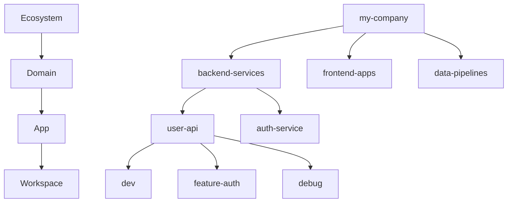

# Quick Start

Get up and running with DevOpsMaestro in 5 minutes.

---

## Prerequisites

1. **Install dvm & nvp** - See [Installation](installation.md)
2. **Container runtime running** - OrbStack, Docker Desktop, Podman, or Colima
3. **Have an app to work with** - Either existing code or we'll create one

!!! tip "First Time?"
    If this is your first time with DevOpsMaestro, we recommend following the [New Project](#new-project-quick-start) path to get familiar with the concepts.

---

## Understanding the Hierarchy

DevOpsMaestro organizes your development environments in a 4-level hierarchy:



| Level | Purpose | Example | Think of it as... |
|-------|---------|---------|-------------------|
| **Ecosystem** | Top-level organization | `my-company` | Your GitHub org |
| **Domain** | Bounded context | `backend-services` | Team/department area |
| **App** | A codebase/repository | `user-api` | One git repo |
| **Workspace** | Dev environment | `dev`, `feature-x` | A tmux session |

---

## New Project Quick Start

### Step 1: Initialize DevOpsMaestro

Run this **once** to set up the database:

```bash
dvm init
```

This creates `~/.devopsmaestro/devopsmaestro.db` with your workspace configurations.

### Step 2: Create Your First App

Let's create a simple Go API from scratch:

```bash
# Create app directory
mkdir ~/Developer/hello-api
cd ~/Developer/hello-api

# Initialize as Go module
go mod init github.com/yourusername/hello-api

# Create a simple main.go
cat > main.go << 'EOF'
package main

import (
    "fmt"
    "net/http"
)

func main() {
    http.HandleFunc("/", func(w http.ResponseWriter, r *http.Request) {
        fmt.Fprintf(w, "Hello from DevOpsMaestro!")
    })
    
    fmt.Println("Server starting on :8080")
    http.ListenAndServe(":8080", nil)
}
EOF
```

### Step 3: Add to DevOpsMaestro

Create the full hierarchy in one command chain:

```bash
# Create ecosystem → domain → app → workspace
dvm create ecosystem personal \
&& dvm create domain apis \
&& dvm create app hello-api --from-cwd \
&& dvm create workspace dev

# Verify your setup
dvm get context
```

You should see:

```
Current Context
  Ecosystem: personal
  Domain:    apis  
  App:       hello-api
  Workspace: dev
```

### Step 4: Build & Launch Your Environment

```bash
# Build the containerized development environment
dvm build

# This will:
# - Detect Go as your language
# - Create a Dockerfile with Go tools
# - Install gopls (Go LSP server)  
# - Configure Neovim with Go plugins
# - Build the container image

# Enter your development environment
dvm attach
```

🎉 **You're now inside a fully-configured Go development container!**

### Step 5: Explore Your Environment

Inside the container, try these commands:

```bash
# Your app code is mounted at /workspace
ls -la
# main.go  go.mod

# Go tools are ready
go version
go run main.go &  # Start your API in background

# Test your API
curl http://localhost:8080
# Hello from DevOpsMaestro!

# Neovim is configured with LSP
nvim main.go
# - Syntax highlighting ✓
# - Go LSP (gopls) with autocomplete ✓  
# - Error detection ✓
# - Code formatting ✓

# Exit when done
exit
```

---

## Existing Project Quick Start

Already have an app? Add it to DevOpsMaestro:

### For an Existing Go App

```bash
# Navigate to your existing app
cd ~/Developer/my-existing-app

# Add to DevOpsMaestro (creates ecosystem/domain if needed)
dvm create ecosystem my-company
dvm create domain backend  
dvm create app my-existing-app --from-cwd
dvm create workspace dev

# Build and launch
dvm build && dvm attach
```

### For Other Languages

DevOpsMaestro auto-detects:

=== "Python"

    ```bash
    cd ~/path/to/python-app  # Must have requirements.txt or pyproject.toml
    dvm create ecosystem personal && dvm create domain webapps
    dvm create app python-app --from-cwd && dvm create workspace dev
    dvm build && dvm attach
    
    # Inside container: Python + pip + pylsp ready
    ```

=== "Node.js"

    ```bash
    cd ~/path/to/node-app    # Must have package.json
    dvm create ecosystem personal && dvm create domain webapps
    dvm create app node-app --from-cwd && dvm create workspace dev  
    dvm build && dvm attach
    
    # Inside container: Node + npm + typescript-language-server ready
    ```

=== "Rust"

    ```bash
    cd ~/path/to/rust-app    # Must have Cargo.toml
    dvm create ecosystem personal && dvm create domain systems
    dvm create app rust-app --from-cwd && dvm create workspace dev
    dvm build && dvm attach
    
    # Inside container: Rust + cargo + rust-analyzer ready
    ```

---

## Understanding Workspaces

Workspaces are your actual development environments. You can have multiple per app:

```bash
# Create different workspaces for different purposes
dvm create workspace dev --description "Main development"
dvm create workspace feature-auth --description "Auth feature branch" 
dvm create workspace debug --description "Debugging with extra tools"
dvm create workspace testing --description "Running test suites"

# Switch between workspaces
dvm use workspace feature-auth
dvm build  # Build this workspace's container
dvm attach # Enter this specific environment

# List all workspaces
dvm get workspaces
```

Each workspace can have:
- Different Neovim configurations
- Different installed tools  
- Different themes
- Different environment variables

---

## Essential Commands

### Navigation & Context

```bash
# Check where you are
dvm get context        # Current active levels
dvm status            # Overview of everything

# Switch context  
dvm use ecosystem personal
dvm use domain frontend
dvm use app web-app
dvm use workspace dev

# Clear context
dvm use --clear       # Clear all
dvm use app none      # Clear app + workspace
```

### Listing Resources

```bash
# List everything at each level
dvm get ecosystems     # All ecosystems
dvm get domains        # Domains in current ecosystem
dvm get apps           # Apps in current domain
dvm get workspaces     # Workspaces in current app

# List across boundaries
dvm get apps --all     # All apps across all domains
dvm get workspaces -A  # All workspaces across all apps
```

### Container Management

```bash
# Container lifecycle
dvm build              # Build workspace container
dvm attach             # Enter container  
dvm detach             # Exit container
dvm rebuild            # Force rebuild container

# Check container status
dvm get platforms      # Available Docker/Podman/etc
dvm get workspaces     # Shows container status
```

---

## Themes & Customization

DevOpsMaestro has a hierarchical theme system:

```bash
# Set theme at different levels
dvm set theme gruvbox-dark --ecosystem personal    # Affects all children
dvm set theme catppuccin-mocha --domain apis       # Override for this domain
dvm set theme "" --app hello-api                   # Clear override (inherit)

# See available themes
nvp get themes

# View theme resolution
dvm get app hello-api --show-theme
```

Themes cascade down the hierarchy: Ecosystem → Domain → App → Workspace.

---

## Shorthand Commands

Speed up your workflow with kubectl-style aliases:

| Resource | Full Command | Shorthand |
|----------|-------------|-----------|
| Ecosystem | `dvm create ecosystem` | `dvm create eco` |
| Domain | `dvm create domain` | `dvm create dom` |  
| App | `dvm create app` | `dvm create a` |
| Workspace | `dvm create workspace` | `dvm create ws` |

### One-Line Setup

```bash
# Create entire hierarchy in one line
dvm create eco personal && dvm create dom apis && dvm create a hello-api --from-cwd && dvm create ws dev

# Build and launch
dvm build && dvm attach
```

---

## What's Happening Behind the Scenes?

When you run `dvm build`:

1. **Language Detection** - Scans for `go.mod`, `package.json`, `requirements.txt`, etc.
2. **Dockerfile Generation** - Creates optimized Dockerfile with dev tools
3. **Container Build** - Builds image with runtime + LSP servers + utilities  
4. **Neovim Configuration** - Sets up plugins, LSP, and themes
5. **Volume Mounting** - Prepares to mount your code

When you run `dvm attach`:

1. **Container Start** - Launches container from built image
2. **Code Mount** - Mounts your app directory to `/workspace`
3. **Shell Setup** - Configures shell with dev tools in PATH
4. **Theme Application** - Applies resolved theme to terminal/Neovim

---

## Troubleshooting

### "No container platform available"

```bash
# Check platform status
dvm get platforms

# Start your platform
# OrbStack: Open OrbStack app
# Docker: Open Docker Desktop
# Colima: colima start
```

### "Build failed"

```bash
# Check Docker connectivity
docker ps

# Rebuild with verbose output
dvm build --verbose

# Check Dockerfile was generated
ls -la .devopsmaestro/
```

### "App not found"

```bash
# Check current context
dvm get ctx

# List available apps  
dvm get apps --all

# Switch to correct app
dvm use app your-app-name
```

---

## Next Steps

Now that you have the basics:

- **[Working with Existing Apps](existing-projects.md)** - Detailed guide for existing codebases
- **[Creating New Apps](new-projects.md)** - More examples and language-specific setups
- **[dvm Commands Reference](../dvm/commands.md)** - Complete command documentation
- **[nvp Overview](../nvp/overview.md)** - Standalone Neovim plugin management
- **[Configuration Guide](../configuration/yaml-schema.md)** - Customize environments with YAML

---

## Cheat Sheet

```bash
# Quick setup for new app
mkdir my-app && cd my-app && git init
dvm create eco personal && dvm create dom apps && dvm create a my-app --from-cwd && dvm create ws dev
dvm build && dvm attach

# Quick setup for existing app  
cd ~/existing-app
dvm create eco company && dvm create dom backend && dvm create a existing-app --from-cwd && dvm create ws dev
dvm build && dvm attach

# Essential daily commands
dvm get ctx           # Where am I?
dvm status           # What's running?  
dvm use app my-app   # Switch apps
dvm attach           # Enter environment
dvm detach           # Exit environment
```
